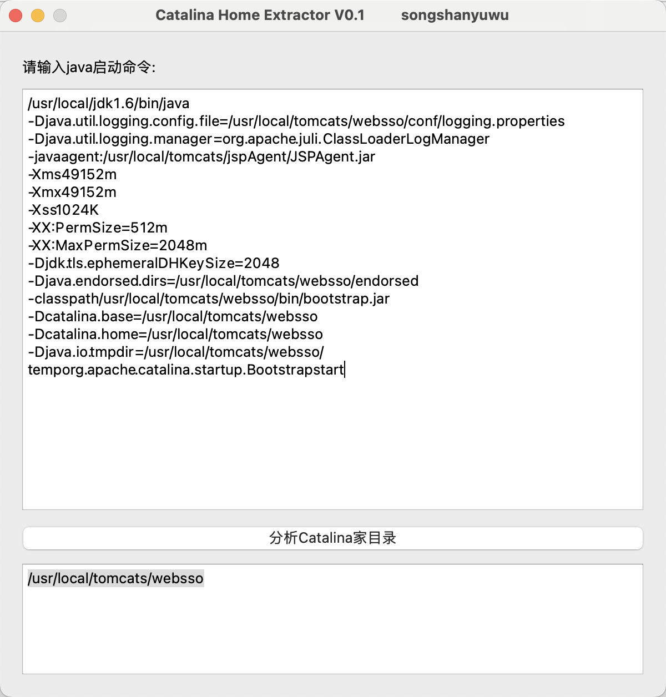

# analysis_catalina
通过java的启动命令分析catalina的所在目录位置

## 假设启动命令为：
/usr/local/jdk1.6/bin/java -Djava.util.logging.config.file=/usr/local/tomcats/websso/conf/logging.properties -Djava.util.logging.manager=org.apache.juli.ClassLoaderLogManager -javaagent:/usr/local/tomcats/jspAgent/JSPAgent.jar -Xms49152m -Xmx49152m -Xss1024K -XX:PermSize=512m -XX:MaxPermSize=2048m -Djdk.tls.ephemeralDHKeySize=2048 -Djava.endorsed.dirs=/usr/local/tomcats/websso/endorsed -classpath /usr/local/tomcats/websso/bin/bootstrap.jar -Dcatalina.base=/usr/local/tomcats/websso -Dcatalina.home=/usr/local/tomcats/websso -Djava.io.tmpdir=/usr/local/tomcats/websso/temp org.apache.catalina.startup.Bootstrap start

## 格式化：
/usr/local/jdk1.6/bin/java
-Djava.util.logging.config.file=/usr/local/tomcats/websso/conf/logging.properties
-Djava.util.logging.manager=org.apache.juli.ClassLoaderLogManager
-javaagent:/usr/local/tomcats/jspAgent/JSPAgent.jar
-Xms49152m
-Xmx49152m
-Xss1024K
-XX:PermSize=512m
-XX:MaxPermSize=2048m
-Djdk.tls.ephemeralDHKeySize=2048
-Djava.endorsed.dirs=/usr/local/tomcats/websso/endorsed
-classpath/usr/local/tomcats/websso/bin/bootstrap.jar
-Dcatalina.base=/usr/local/tomcats/websso
-Dcatalina.home=/usr/local/tomcats/websso
-Djava.io.tmpdir=/usr/local/tomcats/websso/temporg.apache.catalina.startup.Bootstrapstart

## 结果：
/usr/local/tomcats/websso

